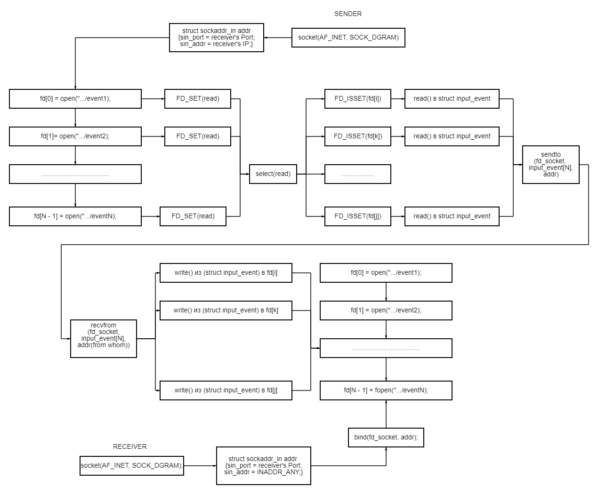

<h1 align="center" style="border-bottom: none">
	Linux HID over network
</h1>

Linux HID over network, a project that was created to forward events of user input devices (mouse, keyboard, touchscreen, etc.) from one device to another.

The following Linux mechanisms were used in the project:

* [Linux Input Subsystem](https://kernel.org/doc/html/latest/input/index.html).
* [Linux socket interface](https://man7.org/linux/man-pages/man2/socket.2.html).
* [Linux select interface](https://man7.org/linux/man-pages/man2/select.2.html).

## Architecture overview



## Using Linux HID over network

### Server
It is responsible for receiving events from the sender (client) to the port and registers them in its file descriptors.
You need to specify the port for receiving I/O device events and, separated by a space, the event files where to redirect them:

```shell
cd server/
make
sudo ./receiver 8000 event2 event4
```

### Client
It is responsible for sending events of its I/O devices to the server (receiver).
You need to specify the server address and port for receiving I/O device events and, separated by a space, the event files that need to be redirected:

```shell
cd client/
make
sudo ./sender 192.168.239.129:8000 event2 event4
```
