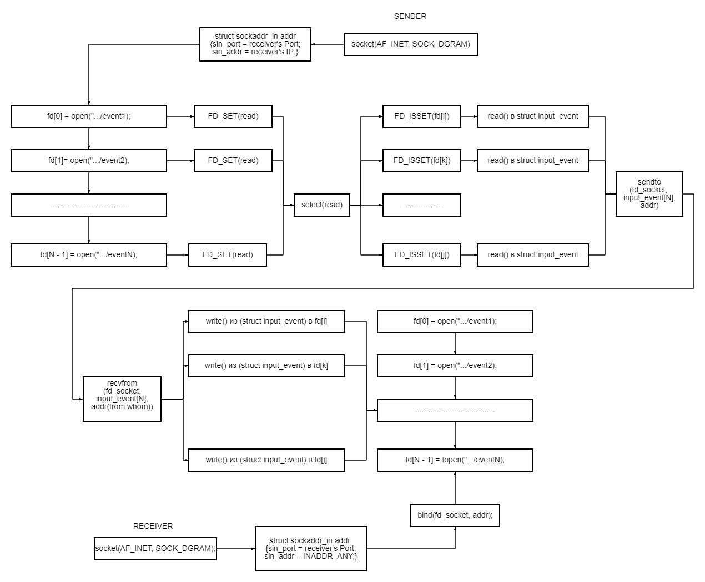

# Linux-HID-over-network
Пересылка событий пользовательского устройства ввода с одного устройства на другое.
<h1 align="center" style="border-bottom: none">
    <a href="https://prometheus.io" target="_blank"></a><br>Linux HID over network
</h1>

Linux HID over network — это проект, который был создан для пересылки событий пользовательских устройств ввода (мыши, клавиатуры, сенсорного экрана и т.д.) с одного устройства на другое.

В проекте были использованы следующие механизмы Linux:

* [Linux Input Subsystem](https://kernel.org/doc/html/latest/input/index.html).
* [Linux socket interface](https://man7.org/linux/man-pages/man2/socket.2.html).
* [Linux select interface](https://man7.org/linux/man-pages/man2/select.2.html).

## Обзор архитектуры



## Использование Linux HID over network

### Server
Он отвечает за получение событий от отправителя (клиента) на порт и регистрирует их в своих файлах, которые отвечают за определенное устройство.
Вам необходимо указать порт для приема событий устройства ввода-вывода и, разделенные пробелом, файлы событий, куда их перенаправлять:

```shell
cd server/
make
sudo ./receiver 8000 event2 event4
```

### Client
Он отвечает за отправку событий своих устройств ввода-вывода на сервер (получатель).
Вам необходимо указать адрес сервера и порт для передачи событий устройств ввода-вывода и, разделенные пробелом, файлы событий, которые необходимо перенаправить:

```shell
cd client/
make
sudo ./sender 192.168.239.129:8000 event2 event4
```
